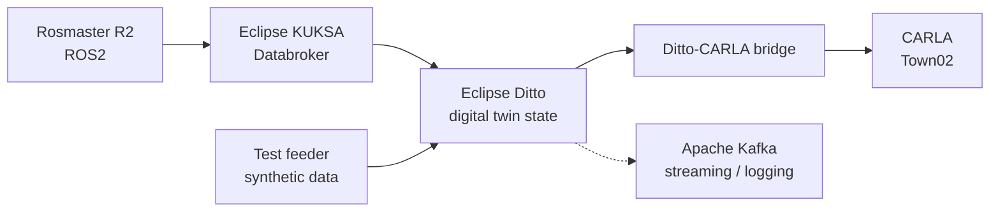

# Smart Digital Twin of an Urban Intersection

A small-scale digital twin of an urban intersection. Physical robotic vehicles in a controlled lab environment are mirrored by virtual vehicles in a CARLA simulation, giving a shared bird's-eye view (the **SkyEye**) of the intersection that can support safety analysis such as occlusion, conflicting trajectories, and unsafe proximity.

This is a university capstone project, built as a small-scale proof of concept. It is not intended for use on public roads.

## Status

The project is being developed incrementally:

| Stage | Description | State |
|---|---|---|
| 1 | Synthetic vehicle data validates the communication and digital twin infrastructure | In progress |
| 2 | One physical robotic vehicle (Rosmaster R2) synchronized with CARLA | Planned |
| 3 | Two or more physical vehicles, scripted and repeatable scenarios | Planned |
| 4 | SkyEye view, AI-assisted safety recommendations, Kafka streaming and logging | Planned |

## Architecture



This is a simplified view. See Appendix A (Figure A.1) of the project report for the full proposed architecture.

| Component | Role |
|---|---|
| ROS2 | Communication between physical vehicles and software components |
| Eclipse KUKSA Databroker | Vehicle signals (gRPC) |
| Eclipse Ditto | Digital representation and current state of each vehicle |
| CARLA | Virtual simulation environment (AWSIM was also evaluated) |
| Apache Kafka | Data streaming, storage and later analysis (planned) |
| Docker | Runs the Ditto stack locally |

## Repository layout

```
.github/workflows/   CI pipeline
bridge/              Ditto to CARLA synchronization (ditto_carla_sync.py)
hardware/            KUKSA to Ditto bridge (kuksa_to_ditto.py)
scripts/             CARLA connection checks, traffic/autopilot tests, Ditto-CARLA agent
tests/               Unit tests and the synthetic telemetry feeder
config/              Settings and the CARLA 0.9.16 Python client (wheel and egg)
docker-compose.yml   Ditto stack (MongoDB, Ditto services, nginx, Mosquitto, UIs)
nginx.conf           Reverse proxy and basic auth in front of the Ditto gateway
policy.json          Ditto policy used for the test vehicle
thing.json           Ditto thing (vehicle_01) used for the test vehicle
requirements.txt     Python dependencies
```

## Prerequisites

- Windows with Docker Desktop (WSL2 backend)
- Python 3.10
- CARLA 0.9.16 server (we run the `Town02` map)
- A GPU capable of running CARLA

## Quick start

All commands are run from the repository root.

**1. Install Python dependencies**

```
python -m venv .venv
.venv\Scripts\activate
pip install -r requirements.txt
pip install config\carla-0.9.16-cp310-cp310-win_amd64.whl
```

**2. Start the Ditto stack**

```
docker compose up -d
docker ps --format "table {{.Names}}\t{{.Ports}}"
```

Wait 60 to 90 seconds for the Ditto services to form their cluster. Every container should be `Up`.

| Port | Service |
|---|---|
| 8080 | nginx, proxying the Ditto API and UI (basic auth `ditto` / `ditto`) |
| 8081 | Ditto gateway, direct access (**dev only, no authentication**) |
| 1883 / 9001 | Mosquitto (MQTT / WebSocket) |
| 27017 | MongoDB (data is kept in the `mongo-data` volume) |

Check that Ditto answers:

```
curl.exe -u ditto:ditto http://localhost:8080/api/2/things
```

**3. Start the CARLA server**, then run the agent. It connects, loads `Town02`, spawns a vehicle and prints some spawn points:

```
python scripts/ditto_carla_agent.py
```

**4. Publish synthetic telemetry.** The feeder creates the policy and thing if they don't exist, then streams position updates at about 20 Hz. Pick a spawn point printed by the agent so the vehicle starts on a road:

```
python tests/test_feeder.py --x -7.5 --y 142.2 --yaw 90
```

The agent's window should show `SYNCED` and the vehicle should move. The feeder drives in a straight line and then turns, so it does not follow the road network.

## Testing

```
pytest
```

Tests that talk to CARLA or Ditto need those services running first. CI cannot run the CARLA simulator, so those tests are not expected to pass on a standard runner.

## Troubleshooting

- **Use `localhost`, not `127.0.0.1`, for Ditto on Windows.** Requests to `127.0.0.1:8080` were reset in our setup while `localhost` worked.
- **PATCH needs the right content type.** Ditto only accepts `Content-Type: application/merge-patch+json` for PATCH. Plain `application/json` is rejected, so use PUT if you want to send plain JSON.
- **Vehicle appears under the map.** The vehicle's height comes from the road surface at the received x/y, not from the published `z`. Check that the published coordinates are on a Town02 road (use the spawn points the agent prints).
- **Empty replies or resets after changing the compose file.** Run `docker compose down`, then `docker compose up -d`, and wait a minute. Make sure no two services publish the same host port.
- **Ditto data disappeared.** `docker compose down -v` deletes the `mongo-data` volume. Plain `down` keeps it.
- **CARLA client and server must match.** The client wheel in `config/` is for CARLA 0.9.16 and Python 3.10 on Windows.

## Engineering targets

Targets from the project report. They are subject to validation.

| Requirement | Target |
|---|---|
| Telemetry payload (REQ-SYS-001) | Structured state vector (x, y, z, speed, heading, yaw rate, trajectory), JSON over MQTT/HTTP |
| End-to-end latency (REQ-SYS-002) | At most 100 ms, from sensor to CARLA rendering |
| Update rate (REQ-SYS-003) | At least 10 Hz (target 20 Hz) |
| Position accuracy (REQ-SYS-004) | Within 5 cm after mapping lab coordinates into CARLA (e.g. 1:10 scale) |
| Heading accuracy (REQ-SYS-005) | Within 2 degrees |
| Bird's-eye rendering (REQ-SYS-006, 007) | At least 30 FPS, at most 100 ms display delay |
| Scalability (REQ-SYS-008, 009) | 10 concurrent vehicles within 150 ms; add vehicles without restarting |
| Logging (REQ-SYS-010) | 10 Hz, UTC timestamps at 1 ms precision |
| Safety metrics (REQ-SYS-011) | Compute time-to-collision and headway; flag events when TTC drops below 1.5 s |

## Roadmap

- Connect a physical Rosmaster R2 through ROS2 and KUKSA
- Coordinate-frame mapping from the lab room to CARLA world space
- Multi-vehicle support and scripted scenarios (straight, turn, stop, speed change, set routes)
- SkyEye bird's-eye view
- Safety metrics (TTC, headway) and an AI-assisted recommendation component (warnings, slow down, stop, re-plan)
- Kafka streaming and a local database for logging
- CI/CD
