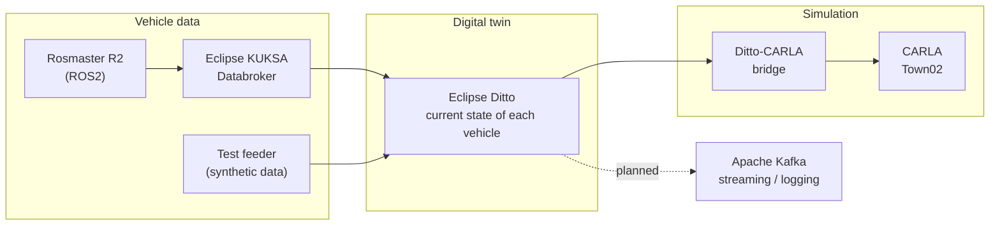

<div align="center">

# Smart Digital Twin of an Urban Intersection

**Real robotic vehicles in a lab, mirrored live in a CARLA simulation, to make intersection safety analysis possible at small scale.**


[Overview](#overview) · [How it works](#how-it-works) · [Run it in 5 steps](#run-it-in-5-steps) · [Targets](#engineering-targets) · [Roadmap](#roadmap) · [Troubleshooting](#troubleshooting)

</div>

<!-- TODO (biggest single upgrade): add a screenshot or short GIF of the lab vehicle and the CARLA vehicle moving together, e.g.
<p align="center"></p>
-->

---

## Overview

An intersection is hard to study safely: you can't stage near-collisions on a real road. This project builds a **small-scale digital twin** instead. Robotic vehicles (Rosmaster R2) drive in a controlled lab, and each one has a virtual counterpart in the [CARLA](https://carla.org/) simulator that follows it in real time.

Together they give a shared bird's-eye view, the **SkyEye**, of the whole intersection. That view is the foundation for safety analysis:

| Hazard | What the twin can reveal |
| ------ | ------------------------ |
| Occlusion | What a vehicle cannot see, but the SkyEye can |
| Conflicting trajectories | Paths that will cross at the same time |
| Unsafe proximity | Time-to-collision and headway dropping below thresholds |

> A university capstone research project, built as a small-scale proof of concept. It is not intended for use on public roads.

### Where the project is today

The system is built in four stages. Stage 1 proves the whole data pipeline using **synthetic** vehicle data, so the infrastructure is validated before any hardware is added.

| Stage | Goal | State |
| :---: | ---- | :---: |
| 1 | Synthetic vehicle data validates the communication and digital twin infrastructure | In progress |
| 2 | One physical vehicle (Rosmaster R2) synchronized with CARLA | Planned |
| 3 | Two or more physical vehicles, scripted and repeatable scenarios | Planned |
| 4 | SkyEye view, AI-assisted safety recommendations, Kafka streaming and logging | Planned |

---

## How it works

Every vehicle is described by a **digital twin** (an Eclipse Ditto "thing") that always holds its latest state: position, speed, heading. Anything that can update that state, a real robot or a test script, drives the simulation the same way.



Solid arrows exist today. The dashed arrow is planned. The full proposed architecture is in Appendix A (Figure A.1) of the project report.

**Why this design?** The twin layer decouples the vehicles from the simulator. Stage 1 uses the feeder, Stage 2 swaps in a real robot, and nothing downstream has to change.

<details>
<summary><b>Technology choices</b></summary>

| Component | Role |
| --------- | ---- |
| ROS2 | Communication between physical vehicles and software components |
| Eclipse KUKSA Databroker | Vehicle signals (gRPC) |
| Eclipse Ditto | Digital representation and current state of each vehicle |
| CARLA | Virtual simulation environment (AWSIM was also evaluated) |
| Apache Kafka | Data streaming, storage and later analysis (planned) |
| Docker | Runs the Ditto stack locally |

</details>

<details>
<summary><b>Repository layout</b></summary>

```
.github/workflows/   CI pipeline
bridge/              Ditto to CARLA synchronization (ditto_carla_sync.py)
hardware/            KUKSA to Ditto bridge (kuksa_to_ditto.py)
scripts/             CARLA connection checks, traffic/autopilot tests, Ditto-CARLA agent
tests/               Unit tests and the synthetic telemetry feeder
config/              Settings and the CARLA 0.9.16 Python client (wheel and egg)
docker-compose.yml   Ditto stack (MongoDB, Ditto services, nginx, Mosquitto, UIs)
nginx.conf           Reverse proxy and basic auth in front of the Ditto gateway
policy.json          Ditto policy used for the test vehicle
thing.json           Ditto thing (vehicle_01) used for the test vehicle
requirements.txt     Python dependencies
```

</details>

---

## Run it in 5 steps

By the end you will see a virtual vehicle driving in CARLA, fed by synthetic data flowing through the full digital twin pipeline.

### Before you begin

- [ ] Windows with **Docker Desktop** (WSL2 backend)
- [ ] **Python 3.10**
- [ ] **CARLA 0.9.16** server installed. Follow the [CARLA quick start installation guide](https://carla.readthedocs.io/en/latest/start_quickstart/) and make sure you download version 0.9.16, because the client in this repo must match the server
- [ ] A GPU capable of running CARLA

All commands run from the repository root in PowerShell or Command Prompt.

### 1. Install the Python dependencies

```powershell
python -m venv .venv
.venv\Scripts\activate
pip install -r requirements.txt
pip install config\carla-0.9.16-cp310-cp310-win_amd64.whl
```

### 2. Start the Ditto stack

```powershell
docker compose up -d
```

Wait **60 to 90 seconds** for the services to form a cluster, then check that every container is `Up`:

```powershell
docker ps --format "table {{.Names}}\t{{.Ports}}"
curl.exe -u ditto:ditto http://localhost:8080/api/2/things
```

**You should see:** all containers `Up`, and the `curl` call returning a JSON response (an empty list on a fresh start).

<details>
<summary><b>What runs on which port</b></summary>

| Port | Service |
| ---- | ------- |
| 8080 | nginx, proxying the Ditto API and UI (basic auth `ditto` / `ditto`) |
| 8081 | Ditto gateway, direct access (**dev only, no authentication**) |
| 1883 / 9001 | Mosquitto (MQTT / WebSocket) |
| 27017 | MongoDB (data is kept in the `mongo-data` volume) |

> **Warning:** The default `ditto` / `ditto` credentials and the open gateway on port 8081 are for local development only. Do not expose these ports beyond your machine.

</details>

### 3. Start CARLA

Launch the CARLA 0.9.16 server (for example `CarlaUE4.exe` from your CARLA install folder) and wait for its window to open.

### 4. Run the agent

```powershell
python scripts/ditto_carla_agent.py
```

**You should see:** the agent connect, load the `Town02` map, spawn a vehicle, and print a list of **spawn points**. Keep this running and note one of the spawn points.

### 5. Send synthetic vehicle data

In a **second terminal** (activate `.venv` again), start the feeder. It creates the Ditto policy and thing if they don't exist, then streams position updates at about 20 Hz. Use a spawn point from step 4 so the vehicle starts on a road (the values below are an example):

```powershell
python tests/test_feeder.py --x -7.5 --y 142.2 --yaw 90
```

**You should see:** `SYNCED` in the agent window, and the vehicle moving in CARLA. The feeder drives in a straight line and then turns, so it does not follow the road network.

That is the full pipeline working: **feeder → Ditto → bridge → CARLA**.

### Shutting down

```powershell
docker compose down
```

This keeps your Ditto data. Use `docker compose down -v` only if you want to wipe it.

---

## Testing

```powershell
pytest
```

Tests that talk to CARLA or Ditto need those services running first. CI cannot run the CARLA simulator, so those tests are not expected to pass on a standard runner.

---

## Troubleshooting

<details>
<summary><b>Ditto resets or won't answer on Windows</b></summary>

Use `localhost`, not `127.0.0.1`. Requests to `127.0.0.1:8080` were reset in our setup while `localhost` worked.

</details>

<details>
<summary><b>PATCH requests are rejected</b></summary>

Ditto only accepts `Content-Type: application/merge-patch+json` for PATCH. Plain `application/json` is rejected, so use PUT if you want to send plain JSON.

</details>

<details>
<summary><b>The vehicle appears under the map</b></summary>

The vehicle's height comes from the road surface at the received x/y, not from the published `z`. Check that the published coordinates are on a Town02 road (use the spawn points the agent prints).

</details>

<details>
<summary><b>Empty replies or resets after changing the compose file</b></summary>

Run `docker compose down`, then `docker compose up -d`, and wait a minute. Make sure no two services publish the same host port.

</details>

<details>
<summary><b>Ditto data disappeared</b></summary>

`docker compose down -v` deletes the `mongo-data` volume. Plain `down` keeps it.

</details>

<details>
<summary><b>CARLA import or connection errors</b></summary>

The client and server versions must match. The wheel in `config/` is for CARLA 0.9.16 and Python 3.10 on Windows.

</details>

---

## Engineering targets

Targets from the project report. They are subject to validation.

| Requirement | Target |
| ----------- | ------ |
| Telemetry payload (REQ-SYS-001) | Structured state vector (x, y, z, speed, heading, yaw rate, trajectory), JSON over MQTT/HTTP |
| End-to-end latency (REQ-SYS-002) | At most 100 ms, from sensor to CARLA rendering |
| Update rate (REQ-SYS-003) | At least 10 Hz (target 20 Hz) |
| Position accuracy (REQ-SYS-004) | Within 5 cm after mapping lab coordinates into CARLA (e.g. 1:10 scale) |
| Heading accuracy (REQ-SYS-005) | Within 2 degrees |
| Bird's-eye rendering (REQ-SYS-006, 007) | At least 30 FPS, at most 100 ms display delay |
| Scalability (REQ-SYS-008, 009) | 10 concurrent vehicles within 150 ms; add vehicles without restarting |
| Logging (REQ-SYS-010) | 10 Hz, UTC timestamps at 1 ms precision |
| Safety metrics (REQ-SYS-011) | Compute time-to-collision and headway; flag events when TTC drops below 1.5 s |

---

## Roadmap

- [ ] Connect a physical Rosmaster R2 through ROS2 and KUKSA
- [ ] Coordinate-frame mapping from the lab room to CARLA world space
- [ ] Multi-vehicle support and scripted scenarios (straight, turn, stop, speed change, set routes)
- [ ] SkyEye bird's-eye view
- [ ] Safety metrics (TTC, headway) and an AI-assisted recommendation component (warnings, slow down, stop, re-plan)
- [ ] Kafka streaming and a local database for logging
- [ ] Extend CI/CD beyond the current pipeline

---

### Acknowledgements

Built on [CARLA](https://carla.org/), [Eclipse Ditto](https://eclipse.dev/ditto/), [Eclipse KUKSA](https://eclipse.dev/kuksa/), and [ROS2](https://docs.ros.org/).

### License

No license has been specified yet. Add a `LICENSE` file (for example MIT or Apache-2.0) and name it here. Without one, the code is "all rights reserved" by default.