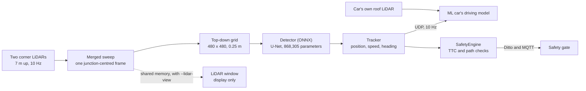
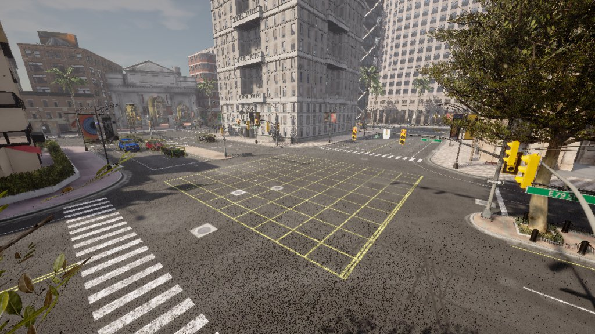
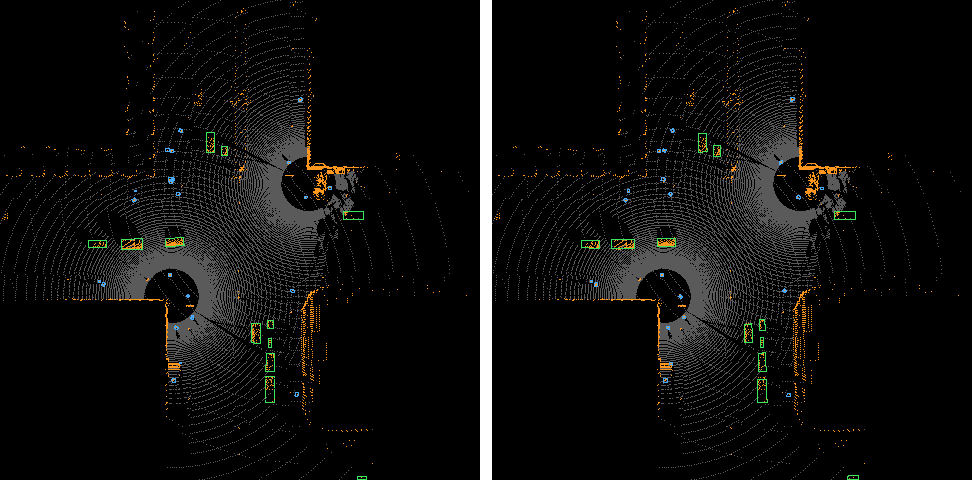
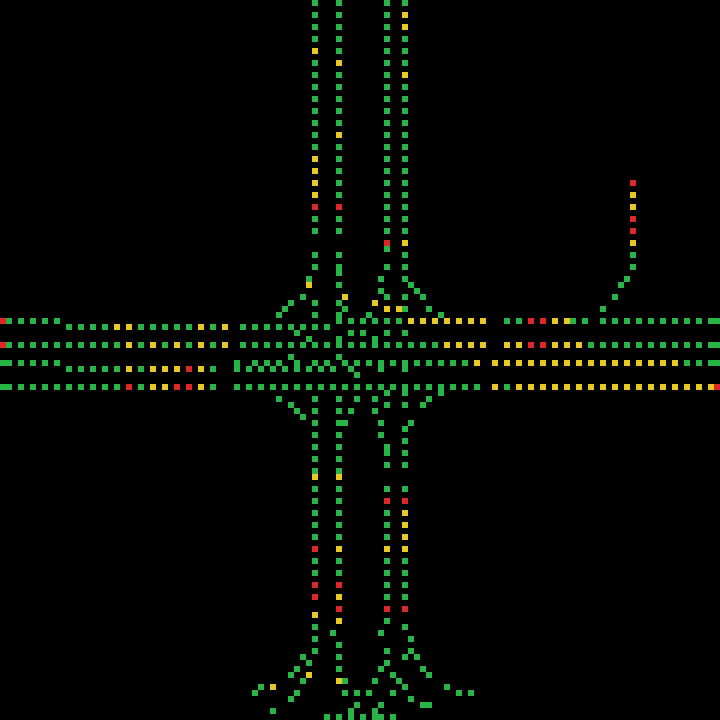
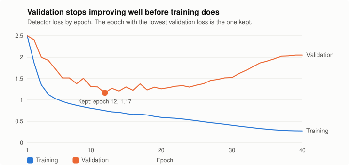
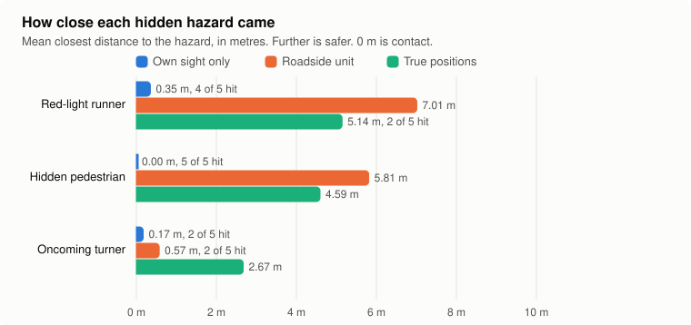
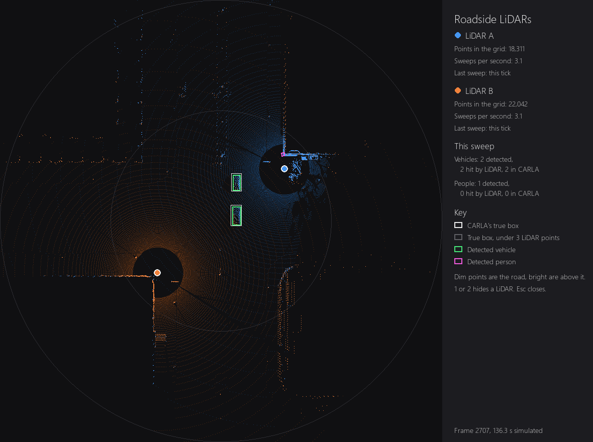
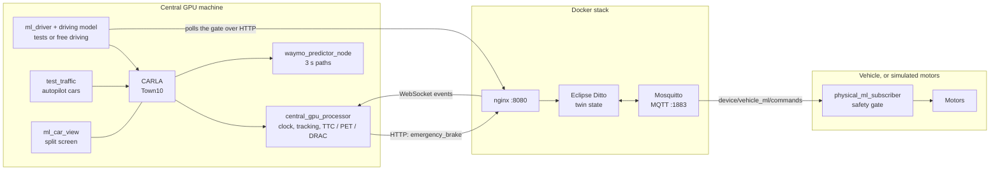

<div align="center">

# Smart Digital Twin of an Urban Intersection

**A CARLA and Eclipse Ditto simulation where a trained model drives a car through an intersection, while a separate safety system watches from above and brakes it before a collision.**


*An unsafe left turn, from the earlier scripted no-traffic run. The safety brake stops the magenta ML car 0.21 m from the oncoming car, which passes, and then it finishes the turn.*

[What it does](#what-it-does) · [Run it](#run-it) · [Test results](#test-results) · [Roadside detection](#roadside-detection) · [How it works](#how-it-works) · [Project status](#project-status) · [Limitations](#known-limitations) · [Training](#train-the-driving-model)

</div>

---

## What it does

You can't stage near-collisions on a real road, so this project studies them in a digital twin of an intersection. It's a university capstone research project and a proof of concept, not for use on public roads.

Running it builds five test situations at an intersection in CARLA's Town10. The magenta **ML car** is driven by a trained model, which chooses its steering and target speed, with a fixed PID controller working the pedals. In normal driving the other cars are CARLA's autopilot; the hazard cars in the tests are scripted. While that happens, the system:

- **Tracks every vehicle** at `Town10_Intersection_01` from an overhead gantry, keeping the ML car's state in an Eclipse Ditto digital twin.
- **Can use a roadside detector instead of CARLA's true positions.** [Two corner LiDARs and a trained model](#roadside-detection) tell the ML car about what it can't see for itself. This is opt-in, and [a live window](#see-the-lidars-working) shows what the LiDARs see.
- **Predicts each vehicle's next 3 seconds.** The ML car uses a [model trained on Waymo data](#train-the-trajectory-model) (the magenta line) and the other cars follow the road (the red lines).
- **Scores the risk** with surrogate safety metrics: time-to-collision (TTC), post-encroachment time (PET) and deceleration rate to avoid a crash (DRAC).
- **Brakes the ML car** when a collision is predicted, sending the command through Ditto and MQTT to a safety gate that cuts the motors. In the simulation those motors are simulated.
- **Follows the ML car** in a split-screen window, in first and third person, showing the model's live inputs and outputs, the safety checks, recent events, and who's in control.
- **Reports the result:** a pass or fail for each test, with what was measured, and a live table in the terminal while it runs.

<p align="center"></p>

*The ML car's window during the left-turn test. It's waiting inside the junction: the next car reaches its route in 2.8 s, so the model asks for almost no speed.*

These pictures are from the earlier scripted left turn, which shows how the safety brake works when a car really does pull out too soon:

| It pulls out too soon | The brake stops it | It finishes the turn | The safe turn, on green, in traffic |
| :---: | :---: | :---: | :---: |
|  |  |  |  |

The ML car has a magenta box and predicted path, other cars have yellow boxes and red paths.

---

## Run it

### You'll need

- Windows with **Docker Desktop** (WSL2 backend)
- **Python 3.10**
- **CARLA 0.9.16** and a GPU that can run it. The client and server versions must match; see the [CARLA install guide](https://carla.readthedocs.io/en/latest/start_quickstart/)

### Install

```powershell
python -m venv .venv
.venv\Scripts\activate
pip install -r requirements.txt
pip install config\carla-0.9.16-cp310-cp310-win_amd64.whl
```

### Start everything with one command

```powershell
python run_simulation.py
```

This starts whatever isn't already running (Docker, the Ditto stack, CARLA), opens the ML car's window, runs the five tests in `scripts/run_professor_test_suite.py`, writes the results, then shuts down only what it started. A first CARLA launch can take several minutes. It needs `models/driving_policy.onnx`, which isn't in the repository: see [Train the driving model](#train-the-driving-model).

Only run one copy at a time. A second one on the same CARLA disturbs the first, because it re-provisions the twins and changes the world's settings.

| Test | What must happen |
| ---- | ---------------- |
| 1. Traffic light | Stops before a red line, waits, pulls away on green and gets back up to speed |
| 2. Left turn across traffic | Pulls into the junction, gives way to oncoming cars, and finishes the turn in a gap with no collision, at least 1.5 m from other cars and without the safety gate firing |
| 3. Blind corner | A speeding car from behind a truck runs its red light; the safety gate fires, reaches MQTT, and the car stops with no collision |
| 4. Cut-in | A car moves into the ML car's lane and slows; no collision and no leaving the lane |
| 5. Light change during a left turn | While the car waits inside the junction the light goes yellow; it finishes the turn once no oncoming car is still coming |

While the tests run, the terminal shows events as they happen above one table of live values, then a table of results at the end:

```text
[SCENARIO] === [TEST 2/5] UNPROTECTED LEFT TURN & GAP ACCEPTANCE ===
+-------------------------------------------------------------+
| [TEST 2/5] UNPROTECTED LEFT TURN & GAP ACCEPTANCE   t=3.6 s |
+-------------------------------------------------------------+
| Target speed       16.8 km/h | Min TTC                n/a s |
| Actual speed       18.0 km/h | Path TTC               n/a s |
| Steering               +0.01 | PET                    n/a s |
| Throttle                27 % | Safety brake             off |
| Brake pedal              0 % | Closest car            n/a m |
| Off lane              0.49 m | MQTT               connected |
+-------------------------------------------------------------+
```

Results go to `output/PROFESSOR_DEMO_SUMMARY.md` and `output/PROFESSOR_TEST_SUITE_RESULTS.json`, and every tick's values to `output/live_telemetry.csv`.

| Option | What it does |
| ------ | ------------ |
| `--free-drive` | Normal driving in traffic instead of the five tests |
| `--seconds 120` | With `--free-drive`, how long to drive, which defaults to 300 simulated seconds; 0 runs until Ctrl+C |
| `--traffic 30` and `--walkers 15` | With `--free-drive`, changes the traffic, which defaults to 15 cars and 8 pedestrians |
| `--roadside` | Runs the five tests on the [roadside detector](#roadside-detection) and the car's own LiDAR, instead of CARLA's true positions. It can't be combined with `--free-drive`; [these commands](#run-it-1) drive in traffic with it |
| `--lidar-view` | With `--roadside`, opens a [window of what the two LiDARs see](#see-the-lidars-working) |
| `--quiet` | Leaves out the test suite's live table of values |
| `--no-view` | Doesn't open the ML car's window |
| `--seed 1` | Spawns traffic the same way each run |
| `--leave-running` | Keeps CARLA and Docker up, for faster repeat runs |
| `--carla-exe <path>` | Points at `CarlaUE4.exe`, if it isn't found automatically. Setting `CARLA_EXE` does the same |

Logs go to `output/logs/`. The ML car has no driver without its model, so the launcher refuses to run. For the other models, the scripts use the stand-ins described under [Known limitations](#known-limitations) and say so at startup.

To run or repeat single tests with the simulation already up, use the suite directly. `--repeat` saves to `output/repeat_results.json` instead of the reports.

```powershell
python scripts/run_professor_test_suite.py --only 2
python scripts/run_professor_test_suite.py --only 2 5 --repeat 20 --seed 500
```

<details>
<summary><b>Run the pieces yourself</b></summary>

Run these from the repository root, each long-running one in its own terminal.

**1. Start the stack and set up the twins.** Wait 60 to 90 seconds for Ditto between these two commands. Re-running the second one resets the Things.

```powershell
docker compose -f docker/docker-compose.yml up -d
python scripts/setup_entities.py
```

**2. Start CARLA, then the processor.** It must come first, because it owns the simulation: it loads `Town10HD_Opt`, enables synchronous mode at 10 Hz and drives `world.tick()`. Wait for `Master tick running at 10 Hz`, and exit with Ctrl+C so it can restore CARLA's settings.

```powershell
python scripts/central_gpu_processor.py
```

**3. Start the safety gate.** `--driver sim` uses no motors. On a vehicle, use `--broker <central machine IP>`; it only needs `pip install paho-mqtt`.

```powershell
python scripts/physical_ml_subscriber.py --driver sim
```

**4. Start the predictor, the traffic and the ML car's window.** Traffic needs `--asynch`, so that it follows the processor's clock.

```powershell
python scripts/waymo_predictor_node.py
python scripts/test_traffic.py --asynch --near-view --safe -n 15 -w 8 --tm-port 8000 --car-lights-on
python scripts/ml_car_view.py
```

**5. Let the model drive the ML car,** with its report at the end.

```powershell
python scripts/traffic_monitor.py --duration 60
```

The earlier scripted left turns are `python scripts/traffic_left_turn.py --case both`, and with no traffic, `python scripts/left_turn_scenario.py --case both`.

**To mirror your own vehicles instead of running the scenario,** start an agent for each Thing. Each one opens a chase-camera window and spawns a CARLA vehicle named after the Thing, which is how the processor recognises it. These twins hold still while the brake is on, and `human_vehicle` has no safety gate.

```powershell
python scripts/ditto_carla_agent.py
python scripts/ditto_carla_agent.py --thing human_vehicle
```

**The brake latches.** Outside the scenario, release it with:

```powershell
python scripts/setup_entities.py --clear-brake
```

**Shut down** with this. Add `-v` only if you want to wipe the Ditto data.

```powershell
docker compose -f docker/docker-compose.yml down
```

</details>

---

## Test results

All five tests on the current model, each scored on what was measured, with no retries:

| Test | Runs passed | Closest gap, final run |
| ---- | :---: | :---: |
| 1. Traffic light | 5 of 5 | n/a |
| 2. Left turn across traffic | 20 of 20 | 3.70 m |
| 3. Blind corner | 5 of 5 | 8.78 m |
| 4. Cut-in | 5 of 5 | 3.55 m |
| 5. Light change during a left turn | 20 of 20 | 3.64 m |

Tests 2 and 5 vary the oncoming traffic on each run. A harder set, with gaps close to the safe limit, passed 40 of 40 left turns with no collisions and no use of the safety gate, and a closest approach of 3.54 m.

This doesn't prove the car passes every time: 60 of 60 left turns still allows a failure rate of up to about 1 in 20 (95% confidence). All of them were on one approach to one junction, with oncoming cars scripted at 12 m/s.

### Normal driving

Six drives of 300 simulated seconds in traffic of 15 cars and 8 pedestrians, with the safety brake ignored so that these are the model's own mistakes:

| | Distance | Collisions | Red lights | Times it lost its lane |
| - | :---: | :---: | :---: | :---: |
| General driver alone | 5.62 km | 0 | 0 | 0 |
| With the left-turn correction | 5.54 km | 1 | 0 | 0 |

The target is 0.11 collisions per km, which is 1.25 times autopilot's rate in the same traffic. The one collision was an Audi hitting the ML car while it was stopped, on a drive with no left turns, where the two models behave identically. Its cause wasn't examined. Together that's 1 in 11.2 km, which is too little driving to show the target is met, and the 10-run pass test in `training/pass_test.py` hasn't been run on this model.

---

## Roadside detection

The ML car can't see round a parked lorry. Two LiDARs on 7 m poles at opposite corners of the junction can. A trained detector turns their sweeps into tracks and sends them to the car and the safety gate, so the car can react to a red-light runner, a pedestrian or an oncoming turner it can't see for itself.

**It's trained and measured, and it's opt-in.** `python run_simulation.py --roadside` uses it; the default run still uses CARLA's true positions. [Why it isn't the default](#why-it-isnt-the-default) gives the reasons.


```mermaid
flowchart LR
    L["Two corner LiDARs<br/>7 m up, 10 Hz"] --> M["Merged sweep<br/>one junction-centred frame"]
    M --> G["Top-down grid<br/>480 x 480, 0.25 m"]
    G --> D["Detector (ONNX)<br/>U-Net, 868,305 parameters"]
    D --> T["Tracker<br/>position, speed, heading"]
    T -->|"UDP, 10 Hz"| C["ML car's driving model"]
    R["Car's own roof LiDAR"] --> C
    T --> S["SafetyEngine<br/>TTC and path checks"]
    S -->|"Ditto and MQTT"| B["Safety gate"]
    M -.->|"shared memory, with --lidar-view"| V["LiDAR window<br/>display only"]
```

| What a LiDAR sees from its pole | A sweep's true boxes (left) and detected boxes (right) |
| :---: | :---: |
|  |  |

*The sweep on the right is from seed 29, which wasn't used for training or for choosing anything.*



**Where the sensors can see.** In the map, a road point is green if both corners see it, yellow if one does, and red if neither. Standing a car or a person on each of the 570 road points and counting the points that land on it (at least 3 counts as seen):

| | Seen, all 570 points | Seen, within 30 m | Median points within 30 m |
| - | :---: | :---: | :---: |
| Car | 94.7% | 100% | 128 |
| Pedestrian | 57.4% | 92.5% | 10 |

The grid stops 60 m from the centre, and nothing past that is seen at all.

<br clear="right"/>

### Training

| | |
| - | - |
| **Data** | 8 CARLA seeds of 600 sweeps, 1 s apart, 4,800 in all, at mixed traffic levels. About 40,000 points per sweep after cropping to the grid. All from this junction |
| **Split** | 6 seeds train it, seed 28 picks the epoch and thresholds, and seed 29 gives the final figures. Whole seeds are held out, since neighbouring sweeps are nearly the same |
| **Model** | A small U-Net with a CenterNet head: two heatmaps of actor centres, plus each one's offset, size and yaw |
| **Training** | Focal loss, AdamW at 2e-3 with a one-cycle schedule, batch 8, 40 epochs, about 30 s per epoch on an RTX 4080 |
| **Thresholds** | 0.624 for vehicles and 0.561 for pedestrians, the best F1 on seed 28 |



The model kept is from epoch 12. After that it only memorises the training seeds, so more epochs wouldn't help. More varied data might.

Two recording problems were only found by testing, and both needed new data:

- **Scan pattern.** An early model learned one fixed pattern of LiDAR rays and saw 0.66 false vehicle boxes per sweep on a held-out seed. Recording now restarts the sensors at a random rotation every 30 sweeps.
- **AI pedestrians.** `sensor.lidar.ray_cast` passes straight through walkers moved by `controller.ai.walker`, and they report zero speed. The recorded ones walk by `apply_control` instead.

### Results

**Detector on seed 29**, measured once, after everything was chosen. An actor counts if it has at least 3 points on it.

| | Vehicles | Pedestrians | Target |
| - | :---: | :---: | :---: |
| Actors | 6,741 | 14,658 | |
| Average precision | 0.990 | 0.932 | |
| Recall | **94.9%** (missed) | 89.6% (met) | At least 95% / 85% |
| Recall on the road | 94.9% | 89.2% | |
| Recall within 30 m | 96.1% | 89.8% | |
| Precision | 98.6% | 99.7% | |
| False boxes per sweep | **0.155** (missed) | 0.062 (met) | At most 0.1 |
| Position error, median / p90 | 0.14 / 0.43 m | 0.09 / 0.19 m | Median at most 0.3 m (met) |
| Time per sweep on the CPU, median | 40.5 ms | same | At most 50 ms (met) |

Two targets were narrowly missed. They weren't tuned away, because seed 29 can only be a fair test once.

**Tracks against the truth**, live for 180 s with 50 cars and 45 pedestrians, within 30 m of the centre:

| | Cars | Pedestrians |
| - | :---: | :---: |
| Share of the time tracked | 96.0% | 80.9% |
| Position error, median / p95 | 0.22 / 0.78 m | 0.18 / 0.76 m |
| Speed error when moving, median / p95 | 0.66 / 2.18 m/s | 0.34 / 1.70 m/s |
| Heading error when moving, median / p95 | 1.6 / 24.6 degrees | n/a |
| False tracks present at any moment, average | 0.012 | 0.76 |

Of those false pedestrian tracks, 60% are within 3 m of a real actor. Pedestrian tracks are held for 2 s so that someone isn't lost as they step out, which adds to the count. In an empty world there were none. Only something moving at 1 m/s or more can set off the safety gate.

**Does it help the car?** `scripts/run_rsu_comparison.py` runs the same hazards, hidden behind stacked shipping containers, with three versions of the car, 5 runs each, varying the timing from run to run:

- **True positions:** told every actor by CARLA, which no real car could have.
- **Roadside unit:** the detector's tracks plus its own roof LiDAR, with the safety gate on the detector.
- **Own sight only:** only what its roof LiDAR hits, with its motors ignoring the safety gate, since there'd be no roadside unit to feed it. Its positions are CARLA's true ones, which flatters it.



| Hazard | Version | Collisions | Closest, mean | Closest, worst | Runs that stopped in time to brake |
| ------ | ------- | :---: | :---: | :---: | :---: |
| Red-light runner | Own sight only | 4 of 5 | 0.35 m | 0.00 m | 4 |
| | **Roadside unit** | **0 of 5** | 7.01 m | 4.42 m | 5 |
| | True positions | 2 of 5 | 5.14 m | 0.00 m | 4 |
| Hidden pedestrian | Own sight only | 5 of 5 | 0.00 m | 0.00 m | 0 |
| | **Roadside unit** | **0 of 5** | 5.81 m | 5.10 m | 5 |
| | True positions | 0 of 5 | 4.59 m | 3.99 m | 5 |
| Oncoming turner | Own sight only | 2 of 5 | 0.17 m | 0.00 m | 0 |
| | **Roadside unit** | **2 of 5** | 0.57 m | 0.00 m | 4 |
| | True positions | 0 of 5 | 2.67 m | 0.00 m | 2 |
| Clear road, no hazard | All three | 0 of 5 | n/a | n/a | No stops or brakes |

The closest distance is between the outlines of the two actors, so it can reach 0.00 m without CARLA reporting a collision.

How to read this:

- **It helps a lot with the runner and the pedestrian.** Runs with a hit went from 9 of 10 to 0 of 10.
- **It doesn't reduce hits from the oncoming turner.** The car does brake now, but in 2 of 5 runs too late. With no blinker to read, a turn can only be predicted once it has started. Even true positions came within 0.63 m in 3 of 5 runs.
- **Don't read it as better than true positions.** It beat them on the runner, but that's 5 runs with varied timing. 0 of 5 is also compatible with a real failure rate of up to 45% (95% confidence).

**The five tests:**

| Test | Roadside unit, passed | Roadside unit, closest gap | True positions, closest gap (1 run) |
| ---- | :---: | :---: | :---: |
| 1. Traffic light | 5 of 5 | n/a | n/a |
| 2. Left turn across traffic | 5 of 5 | 2.60 to 4.09 m | 3.84 m |
| 3. Blind corner | 5 of 5 | 10.59 m | 8.78 m |
| 4. Cut-in | 5 of 5 | 3.64 m | 3.55 m |
| 5. Light change during a left turn | 5 of 5 | 3.81 to 4.21 m | 3.72 m |

True positions also passed all five in that run, after the pedestrian check was added to the gate.

**False brakes.** In 300 s of driving among 50 cars and 45 pedestrians, the safety gate fired once on each data source, and the car had no collisions and ran no red lights. With the roadside unit it drove 963 m, and the brake was `TTC 0.92 s` with a tracked car. With true positions it drove 879 m, and the brake was `TTC 1.48 s`. Neither was examined further, so they may or may not have been needed. The car's route leaves the sensors' reach for part of each drive, so this doesn't count 300 s of the detector watching it.

### What testing changed

- **The car mustn't rely on the roadside unit alone.** With only roadside tracks, the car hit the cut-in car in 10 of 10 repeats, after passing once at 0.45 m. The tracks were accurate, but the test carries both cars past the 60 m limit, where the car went blind. It now adds what its own LiDAR sees. The hazards were remeasured with that, and only that version's figures are shown above.
- **Lorries don't hide anything from a LiDAR.** It sees legs and wheels underneath them, so the hazards are hidden by containers, which reach the ground.
- **The gate didn't know about people.** It now brakes for anyone moving at 1 m/s or more whose straight path meets the ML car's within 3 s, using a wider 1.8 m radius.
- **Pedestrians' tracks were too slow to follow someone stepping out,** so walkers now have a quicker speed estimate and 2 s of memory, and need 5 sightings in 10 ticks to start a track.

### Why it isn't the default

The rule set before testing was that the detector only replaces true positions if it clearly beats own sight, comes close to true positions, and causes no extra brakes. It passed most of that, but not all:

| Check | Result |
| ----- | :---: |
| Clearly beats own sight | Yes for the runner and pedestrian, **tied on hits for the turner** |
| Close to true positions | Yes on the five tests, **not for the turner** (2 of 5 hits against 0 of 5) |
| No extra brakes | Yes: none on a clear road, 1 against 1 in traffic |
| Detector targets on the held-out seed | **Two narrowly missed** |

There's a practical reason too. The default run has the car on true positions, so renaming the model would put the gate on the detector with the car on true positions, a combination that hasn't been measured. So the model keeps its candidate name, which nothing loads by itself.

To adopt it anyway, for the safety gate in every run:

```powershell
copy models\rsu_detector.candidate.onnx models\rsu_detector.onnx
```

### Run it

The model isn't in the repository, so [train it](#train-it-yourself) first, or copy a trained `models/rsu_detector.candidate.onnx` in.

```powershell
python run_simulation.py --roadside
```

That runs the five tests on the detector and the car's own LiDAR, and saves results to `output/suite_results_rsu.json`. The ML car's window shows which source it's using.

To drive in traffic with it, start each of these in its own terminal, with CARLA and the Docker stack already running. Wait for the processor's `Master tick` before starting the others, and allow the traffic 10 s before the car:

```powershell
python scripts/central_gpu_processor.py --detector onnx --model models/rsu_detector.candidate.onnx
```

```powershell
python training/eval_tracking.py --seconds 300 --seed 12 --traffic-only
```

```powershell
python scripts/ml_driver.py --perception rsu
```

If the gate fires, release it with `python scripts/setup_entities.py --clear-brake`.

### See the LiDARs working

```powershell
python run_simulation.py --roadside --lidar-view
```

This runs the five tests and opens a top-down window of the sweeps the processor is really using. To use it while driving in traffic, add `--lidar-view` to the processor's command above and run `python scripts/lidar_view.py`. Esc closes the window and leaves the simulation running.

<p align="center"></p>

- **Colours:** each LiDAR's points keep their own colour, from the sensor that produced them. Dim points are the road, and bright ones are above it.
- **Boxes:** white is CARLA's true box, and grey is a true box with under 3 LiDAR points on it. Green is a detected vehicle and pink a detected person. A white box with nothing inside is a miss, and a coloured box on its own is a false detection, like the pink one in this image.
- **Health:** the panel measures each LiDAR's points and sweeps per second, and turns red if a sweep is late. It says `NO NEW SWEEPS` after 2 s without one, and `Waiting for the processor` until the feed exists.
- **Keys:** 1 or 2 hides a LiDAR's points, which shows what the other one covers. That only changes the window, and the detector still gets both.

It reads the sweeps through shared memory, so it can't hold up the clock, and the true boxes are only for comparing by eye. In 30 cars with no ML car window, the simulation ran at 9.95 ticks per second without the feed, 9.76 with it, and 9.71 with the window open too, as the mean of two 60 s runs each.

### Reproduce the measurements

Each of these needs CARLA to itself. Results go under `output/`, and the copies behind this page are in [docs/results](docs/results), including each version's tick-by-tick telemetry as `rsu_telemetry_<version>.csv`.

```powershell
# The three-way comparison, about 25 minutes. It starts its own processor, so stop any other
python scripts/run_rsu_comparison.py --repeat 5

# With the processor running as above: tracking, then the five tests repeated
python training/eval_tracking.py --seconds 180 --seed 11 --output output/rsu_tracking.json
python scripts/run_professor_test_suite.py --perception rsu --repeat 5

# The detector on recorded sweeps, which needs no CARLA
python training/eval_detection.py models/rsu_detector.candidate.onnx --seed 29 --threshold 0.624 0.561

# Redraw the charts from docs/results
python training/make_charts.py
```

### Train it yourself

```powershell
# 1. Check what the sensors can see, with the processor running
python training/check_lidar_coverage.py --probe

# 2. Record the sweeps, with the processor running (main Python, which has carla)
python training/record_detection.py --seeds 20 21 22 23 25 26 28 29 --sweeps 600

# 3. Train, in an environment with PyTorch. This saves models/rsu_detector.candidate.onnx
python training/train_detection.py

# 4. Pick thresholds on seed 28, and put them in DETECTION_THRESHOLD in scripts/central_gpu_processor.py
python training/eval_detection.py models/rsu_detector.candidate.onnx --seed 28
```

Then measure it as above, and use seed 29 only once you've chosen a model. A retrained model needs the live tests again, because the recorded-sweep scores don't show how the car behaves: the cut-in failure above only appeared live.

---

## Earlier scripted left-turn results

These are from before the model drove. The ML car follows a scripted plan, so they measure the **safety brake**, not the driving model.

### In real traffic

The ML car waits at a red light to turn left across autopilot cars that have the green. The main junction's lights are held in that phase by the scenario, and every car obeys them.

- **Unsafe:** the ML car deliberately runs its red light, timed to meet an oncoming car.
- **Safe:** it waits while the oncoming light goes amber then red and its own turns green, then turns.

| Over 11 full runs | Unsafe | Safe |
| - | :---: | :---: |
| **Verdict** | UNSAFE, 11 of 11 | SAFE, 11 of 11 |
| **Contact** | none | none |
| **Brake fired** | 9 of 11 | never |
| **Closest gap between cars** | 0.18 m to 7.96 m | 1.35 m to 7.31 m |

The other cars are real, so the unsafe gap varies with how close an oncoming car is and how it reacts. In the 2 runs where the brake didn't fire, the gap stayed at 3.5 m or more. In free driving, over 2 runs of 45 s with the final red-light check, traffic ran 1 red light and the ML car ran none, stopping for each. The ML car touched another car once, in free driving.

A run is **UNSAFE** if the ML car ran a red, the car outlines overlap or come within 1 m, TTC drops under 1.5 s, PET drops under 1.5 s, DRAC goes over 3.35 m/s², or the brake fires. After the hazard passes, the scenario releases the brake as an operator would, so the car can finish its turn. Nothing else auto-releases it.

### Without traffic

`--clean` runs the same turn against one scripted car that never reacts, so it's repeatable, and compares it with the same plan replayed with no brake. These runs varied only the ML car's arrival time:

| Arrives after the oncoming car | Without brake | With brake | Closest gap with brake |
| :---: | :---: | :---: | :---: |
| 0 to 1.25 s | contact | no contact | 0.39 m |
| **1.5 s (the default)** | **contact** | **no contact** | **0.21 m** |
| 1.75 s | contact | no contact | 0.23 m |
| 2 s | miss by 0.11 m | never fires | 0.11 m |
| 2.5 s | miss by 0.67 m | never fires | 0.67 m |
| 3 s (safe) | miss by 1.10 m | never fires | 1.10 m |

Every colliding timing tested was avoided here. A brake that relies on the trained model needs room: on Town01's smaller junction, the same brake prevented none of them, because the model only recognises a turn once the car is already swinging across the lane.

---

## How it works

Each vehicle has a **digital twin** in Eclipse Ditto that holds its latest state. Anything that writes the same telemetry, a real robot or a test script, drives everything downstream the same way, so the vehicles are decoupled from the simulator.


```mermaid
flowchart LR
    subgraph GPU["Central GPU machine"]
        C["CARLA<br/>Town10"] --> P["central_gpu_processor<br/>clock, tracking, TTC / PET / DRAC"]
        C --> W["waymo_predictor_node<br/>3 s paths"]
        S["ml_driver + driving model<br/>tests or free driving"] --> C
        T["test_traffic<br/>autopilot cars"] --> C
        V["ml_car_view<br/>split screen"] --- C
    end
    subgraph Infra["Docker stack"]
        N["nginx :8080"] --> D["Eclipse Ditto<br/>twin state"]
        Q["Mosquitto<br/>MQTT :1883"]
    end
    subgraph Vehicle["Vehicle, or simulated motors"]
        G["physical_ml_subscriber<br/>safety gate"] --> M["Motors"]
    end
    N -->|WebSocket events| P
    P -->|"HTTP: emergency_brake"| N
    D <--> Q
    Q -->|device/vehicle_ml/commands| G
    S -->|polls the gate over HTTP| N
```

**The brake fires** when it can help: never for a car coming up from behind, or while the ML car is already stopped. It has two triggers. Straight-line TTC under 1.5 s catches anything dead ahead, except stopped cars while the ML car is mid-turn, when it's only pointing at them momentarily. Predicted paths meeting within 3 s catches crossing traffic, and ignores stopped cars and cars being followed, which are ordinary traffic. The same check covers people moving at 1 m/s or more, with a wider radius.

**The driving model** takes 76 numbers: its speed, route, any stop line that isn't green, the road ahead, nearby cars and pedestrians, and on a left turn, the time-to-collision with the first car due to reach its route. It outputs steering and a target speed 1 s ahead. A fixed PID controller, which isn't AI, turns that speed into pedals, and the car moves with real CARLA physics. By default it sees positions from CARLA, not cameras or LiDAR. With `--roadside` they come from the [roadside detector](#roadside-detection) and its own LiDAR.

**It's two networks exported as one file.** The general driver copies CARLA's autopilot, from recordings plus takeovers where autopilot rescued the model. Those recordings have no left turns across moving traffic, because this junction gives one approach a green at a time. So a fixed rule built on time-to-collision teaches them, and a small correction network learns from it. Retraining the whole model on those lessons made other driving worse (4 collisions in 5.51 km), so the general driver stays frozen and the correction only acts on a left route. Off a left route, the output matched the general driver exactly on 17,751 recorded samples. The rule isn't used when driving.

**On a left turn** the car pulls about 9 m into the junction and waits short of the oncoming lanes. It sets off once no car is due within its time to get across. If the light goes yellow while it waits, it finishes the turn once no oncoming car is still coming.

**The ML car's predicted path uses only the trajectory model**, for both its line and the brake. It's a separate model from the driving model, and it can only predict. Other cars are real CARLA physics on autopilot.

**The safety gate fails safe.** It holds the motors off before it receives its first state, whenever it loses the broker, and until it hears an explicit release.

| Thing | Role |
| ----- | ---- |
| `org.example:intersection_01` | The intersection; holds the latest `SafetyMetrics` |
| `org.example:vehicle_ml` | The ML vehicle; the only one with a `SafetyGate` |
| `org.example:human_vehicle` | The other vehicle |

<details>
<summary><b>Repository layout</b></summary>

```
run_simulation.py    Starts everything and runs the five tests, or normal driving
docker/              Ditto stack: docker-compose.yml, mosquitto.conf, nginx.conf
config/              Ditto policies, Things and connections, and the CARLA 0.9.16 client
models/              Where trained models go, and the contract they must meet
training/
  record_driving.py           Records autopilot, for the general driver
  record_corrections.py       Records autopilot rescuing the model
  train_driving.py            Trains the general driver
  record_left_turns.py        Records left-turn lessons from a time-to-collision rule
  train_left_turns.py         Adds them to the frozen general driver as a left-only correction
  pass_test.py                The 10-run pass test against autopilot
  check_lidar_coverage.py     Measures what the corner LiDARs can see
  record_detection.py         Records their sweeps with true boxes, for the roadside detector
  train_detection.py          Trains the roadside detector
  eval_detection.py           Scores it on recorded sweeps
  eval_tracking.py            Scores its live tracks against the truth
  make_charts.py              Draws this page's charts from docs/results
  convert_waymo.py, train_trajectory.py    Trains the trajectory model
scripts/
  run_professor_test_suite.py The five tests and their reports
  run_rsu_comparison.py       The three-way hidden hazard comparison
  roadside_link.py            What the ML car is told: true positions, roadside tracks or own sight
  detection_features.py       The roadside detector's inputs, outputs and labels
  ml_driver.py                Drives the ML car from the model, and its driving report
  driving_features.py         The model's inputs and outputs, and the PID controller
  model_panel.py              The window's cards, and the live values sent to it
  central_gpu_processor.py    Simulation clock, overhead sensors, fusion, metrics, brake trigger
  waymo_predictor_node.py     History buffer, 3 s path prediction, drawn lines
  physical_ml_subscriber.py   Safety gate that cuts the motors (runs on the vehicle)
  traffic_left_turn.py        Earlier scripted safe vs unsafe left turn across real traffic
  traffic_monitor.py          The ML car in normal traffic, its lane and route logic, and the traffic report
  ml_car_view.py              Split-screen window following the ML car
  lidar_view.py               Top-down window of what the two roadside LiDARs see
  left_turn_scenario.py       Earlier scripted left turn with no traffic, and its analysis
  setup_entities.py           Provisions Ditto from config/
  ditto_carla_agent.py        Mirrors one Thing into CARLA, with a chase camera
  test_carla_connection.py    CARLA connection check
  test_traffic.py             Spawns the autopilot cars and pedestrians
tests/               Unit tests and the end-to-end latency benchmark
hardware/            KUKSA to Ditto publisher, for physical vehicles
bridge/              Older standalone Ditto to CARLA sync
docs/images/         The pictures on this page
docs/results/        The measurements behind the roadside results
```

</details>

<details>
<summary><b>Ports and telemetry format</b></summary>

| Port | Service |
| ---- | ------- |
| 8080 | nginx, proxying the Ditto API and WebSocket. It injects the `x-ditto-pre-authenticated` header |
| 8081 | Ditto gateway, direct access |
| 1883 / 9001 | Mosquitto (MQTT / WebSocket) |
| 27017 | MongoDB (data is kept in the `mongo-data` volume) |

> **Warning:** Nothing here authenticates. Anyone who can reach 8080 can write to the twins, and anyone who can reach 1883 can publish telemetry or brake commands. Keep these ports on a trusted lab network.

Vehicles publish [Ditto Protocol](https://eclipse.dev/ditto/protocol-overview.html) JSON to `telemetry/<thing name>`. The processor reads `location` + `velocity` (m/s), or `kinematics` as written by `hardware/kuksa_to_ditto.py` (`x`, `y`, `heading` in degrees, `speed` in km/h). Poses must already be in the CARLA frame.

```json
{
  "topic": "org.example/human_vehicle/things/twin/commands/merge",
  "headers": { "content-type": "application/merge-patch+json", "response-required": false },
  "path": "/features",
  "value": {
    "location": { "properties": { "x": 12.0, "y": 4.5, "z": 0.0 } },
    "velocity": { "properties": { "vx": 1.5, "vy": 0.0 } }
  }
}
```

</details>

---

## Project status

| Area | State |
| ---- | ----- |
| Docker stack, Ditto twins, MQTT safety path | **Working**, tested live |
| One-command launcher | **Working**, including starting CARLA and the Ditto stack. Starting Docker Desktop itself isn't tested |
| Master tick, overhead view, on-screen overlays | **Working** in CARLA |
| Driving model | **Working in simulation.** All five tests pass. The 10-run pass test against autopilot hasn't been run on this model |
| Left turn across traffic | **Working.** Tests 2 and 5 passed 20 of 20 each on one approach to one junction, with scripted oncoming cars at 12 m/s |
| Free driving, reports, live terminal table | **Working** |
| Split-screen ML car window | **Working**, showing the model's real inputs and outputs |
| Path prediction | **Working.** The ML car uses a [model trained on Waymo data](#train-the-trajectory-model), falling back to road-following without it. Other cars follow the road |
| Roadside detection | **Working in simulation, opt-in with `--roadside`.** The default still uses CARLA's true positions, [for these reasons](#why-it-isnt-the-default). Trained and tested on this one junction |
| LiDAR window | **Working** with `--roadside`. It's only a display, and costs about 2% of the tick rate |
| Physical vehicles (Rosmaster R2, KUKSA) | **Written, not yet run on hardware.** The motor drivers and KUKSA publisher have never run |
| Fully autonomous physical vehicle (Autoware) | **Not started.** Planned last |
| Lab-to-CARLA coordinate mapping, SkyEye view, Kafka logging, AI recommendations | **Not started** |

### Engineering targets

These are the targets from the project report, against what has been measured so far.

| Requirement | Target | Measured so far |
| ----------- | ------ | --------------- |
| End-to-end latency (REQ-SYS-002) | At most 100 ms, sensor to CARLA rendering | About 60 ms (p95) from Ditto write to simulated motor cut, on one machine. The sensor-to-rendering path isn't measured |
| Update rate (REQ-SYS-003) | At least 10 Hz (target 20 Hz) | 10.0 Hz simulation tick, at real-time speed with 15 cars. It fell to about 2 Hz in a `--roadside --lidar-view` run of the five tests, with both windows open |
| Safety metrics (REQ-SYS-011) | TTC and headway; flag TTC under 1.5 s | TTC, PET and DRAC done, and the 1.5 s flag works. Headway isn't implemented |
| Telemetry payload (REQ-SYS-001) | Full state vector, JSON over MQTT/HTTP | Position and velocity only |
| Position and heading accuracy (REQ-SYS-004, 005) | Within 5 cm and 2 degrees | Not measured; needs physical vehicles |
| Bird's-eye rendering (REQ-SYS-006, 007) | At least 30 FPS, at most 100 ms delay | **Not met for FPS.** CARLA draws one frame per tick, so 10 FPS at most. The delay isn't measured |
| Scalability (REQ-SYS-008, 009) | 10 vehicles within 150 ms | Not measured |
| Logging (REQ-SYS-010) | 10 Hz, UTC timestamps at 1 ms precision | Scenario data only, in simulation time |

---

## Known limitations

- **Left turns are only trained and tested on one approach to one junction,** against oncoming cars scripted at 12 m/s. The correction acts on every left route, so left turns elsewhere have changed, but have only had normal-driving use.
- **The model's time-to-collision assumes each car keeps its speed and heading,** so it won't foresee a car turning across its route. A car that runs its red light with room to stop is left to the safety gate.
- **The driving model is limited by what it copied.** It tops out at about 20 km/h, as autopilot did in the recordings, and by default sees positions from CARLA rather than cameras or LiDAR.
- **The brake is only tested at one junction.** On Town01's smaller junction it prevented none of the same collisions, so don't assume it carries over.
- **The trajectory model can't see a turn signal or the map.** It only recognises a turn once the car has started it.
- **Free-drive pedestrians are invisible to the brake.** It only acts on people moving at 1 m/s or more, and CARLA's AI walkers report zero speed. A LiDAR passes straight through them too, so the detector can't see them either. The roadside tests and recordings use walkers moved by `apply_control`.
- **The roadside detector only knows one junction and one sensor layout.** It covers 60 m from the centre, it would need retraining for anything else, and it has never seen real LiDAR data. Past that reach the safety gate has no track of the ML car and doesn't protect it, and the processor logs a warning.
- **Oncoming turners still hit the roadside car,** in 2 of 5 runs, since a turn can't be predicted before it starts. See [the comparison](#results).
- **Pedestrians where the sensors see little are at risk.** 2 m past the stop line, where a person gets 0 to 3 LiDAR points and none were recorded, the car using roadside tracks alone hit them in 4 of 5 runs. On the marked crossing it was none in 5. That spot hasn't been retested with the car's own LiDAR added.
- **The comparison tells the car where its containers are.** A stopped car close to one is dropped from what the car is told, because the detector calls containers cars and the car would queue behind them forever. A real unit would have to learn its background. The safety gate still receives those tracks.
- **The link from the roadside unit is local UDP,** with no loss handling or signing. A real one needs a V2X radio. If its tracks go stale the car brakes.
- **The simulation is built around 10 Hz.** The models, the speed controller and the LiDAR sweeps all assume a 0.1 s tick, so a faster tick isn't a one-line change, and every result here would need measuring again.
- **The five tests can run well below 10 Hz.** One `--roadside --lidar-view` run held about 2 ticks per second. The LiDAR feed costs about 2%, so it isn't the cause, and the ML car window's cameras are the main suspect, but that hasn't been measured. Other setups haven't been timed during the tests.
- **The detector can see a person who isn't there.** The LiDAR window showed a stationary false person on the kerb by one pole. It doesn't move, so it shouldn't set off the safety gate. Whether it becomes a track that changes how the car drives hasn't been checked.
- **The server crashed once** during the roadside work, with exit code 3 and no crash log. The cause wasn't found.
- **More traffic is less stable.** At 40 cars, the brake's repeated stops could strand the ML car in the junction and cause contact. The default of 15 didn't.
- **In the earlier scripted left turns the ML car isn't physics-driven.** They move it directly along its plan. When the model drives, it uses real physics.
- **Cars are recycled.** Autopilot routes wander off, so cars far from the intersection are moved back onto nearby roads, out of sight, to keep it busy.
- **Other cars' boxes show in the ML car's window.** CARLA draws debug shapes into every camera. The ML car's own box is hidden by drawing it above its cameras' view.
- **The path check needs a track in CARLA's frame.** Telemetry alone falls back to the 1.5 s TTC rule. That includes physical vehicles until lab positions are mapped into CARLA.
- **No trained models are in the repo.** The driving and trajectory models are trained locally, and the trajectory model stays out of git until the Waymo licence is checked. The roadside detector is trained locally too, and the default run doesn't use it. See [models/README.md](models/README.md).
- **The trajectory model can't anticipate a turn.** It only sees 1 s of motion, with no map or turn signal. See [its results](#train-the-trajectory-model).
- **The vehicle can't tell if the processor has died.** The gate fails safe if the broker link drops, but a crashed processor simply stops sending hazards.
- **A silent Wi-Fi drop took 3.8 s to detect** in testing, which is longer than the 1.5 s brake window. Lowering `MQTT_KEEPALIVE` shortens it.
- **Live PET is predicted.** The `SafetyMetrics` Thing holds PET extrapolated from current velocities. The scenario report's PET is measured after the fact.
- **`bridge/ditto_carla_sync.py` is out of date.** It still points at `org.ovin:my-vehicle` on `192.168.0.100`.

---

## Train the driving model

Recording needs the main environment, which has `carla`, and CARLA with the processor running. Training needs an environment with `torch`, like the one in the next section's step 1. Each step uses what the one before it saved under `data/driving/`, which git ignores.

**1. Record autopilot, then convert it.** Recording also needs `test_traffic.py` running. Conversion doesn't need CARLA.

```powershell
python training\record_driving.py --minutes 60
python training\record_driving.py --convert
```

**2. Train the general driver.** It must go to `driving_general.onnx`, because the next steps build on it.

```powershell
python training\train_driving.py --output models\driving_general.onnx
```

**3. Record takeovers and train again,** which teaches it to recover from its own mistakes. This needs a model to drive, so copy `driving_general.onnx` to `driving_policy.onnx` first. Good numbers from training only mean it copies well: only driving it in CARLA shows that it can drive.

```powershell
python training\record_corrections.py --episodes 6 --minutes 5
python training\train_driving.py --output models\driving_general.onnx
```

**4. Add left turns.** Record lessons from the rule, then record more with the model driving and the rule labelling, which captures the model's own mistakes. Train between rounds, so that the model-driven round uses the newest model.

```powershell
python training\record_left_turns.py --runs 20
python training\train_left_turns.py
python training\record_left_turns.py --runs 20 --model-share 1.0 --light-change-share 0.25
python training\train_left_turns.py
```

**5. Check it,** with the tests, then the pass test against autopilot. Run the pass test once with the brake ignored to measure the model alone, and once with it active. It needs `test_traffic.py` running.

```powershell
python scripts\run_professor_test_suite.py --only 2 5 --repeat 20
python training\pass_test.py --ignore-brake
python training\pass_test.py
```

---

## Train the trajectory model

This trains `models/waymo_trajectory.onnx` on the [Waymo Open Motion Dataset](https://waymo.com/open), which needs a free account and is licensed for non-commercial use. The predictor and processor load the file automatically on their next run, and deleting it returns everything to road-following.

**1. Install the training tools,** in a separate environment. The `carla` package isn't needed here.

```powershell
python -m venv .venv
.venv\Scripts\activate
pip install torch --index-url https://download.pytorch.org/whl/cu124
pip install -r training\requirements.txt
```

**2. Download some shards** from `gs://waymo_open_dataset_motion_v_1_3_1/uncompressed/tf_example/` into `data/waymo/training/` and `data/waymo/validation/`. Git ignores `data/`.

**3. Convert them, then train.** Training takes about a minute on an RTX 4080 with 10 shards.

```powershell
python training\convert_waymo.py data\waymo\training data\waymo\converted\training.npz
python training\convert_waymo.py data\waymo\validation data\waymo\converted\validation.npz
python training\train_trajectory.py
```

The main Python environment also needs `onnxruntime` to load the model, which `requirements.txt` installs.

### Results

The model is a small GRU that learns a correction on top of constant velocity. These are mean position errors over 3 s, on 2 Waymo validation shards, after training on 10 of the 1,000 training shards. The best epoch was picked on those same shards, so they're slightly optimistic.

| Vehicles | Samples | Constant velocity | Trained model |
| -------- | :---: | :---: | :---: |
| All | 4,865 | 1.54 m | **0.82 m** |
| Going straight | 4,482 | 1.40 m | **0.79 m** |
| Turning left | 219 | 3.16 m | **1.14 m** |
| Turning right | 164 | 3.12 m | **1.26 m** |

In a CARLA left turn, road-following predicts better, though it's only an option when the road and the car's intent are known:

| The turning car, with a turn coming within 3 s | Mean error |
| ---- | :---: |
| Constant velocity | 3.25 m |
| Trained model | 1.89 m |
| Road-following | 1.03 m |

The road-following figure is a best case, scored along the lane the car really took. The model's weakness is what it can't see: at the stop line its line goes straight on even with the car signalling left, and at the end of a turn it keeps curving after the road straightens. Those numbers are from Town01.

---

## Testing

```powershell
pytest
ruff check .
```

CI runs both on every push and pull request to `main`, on Ubuntu with no CARLA or Docker stack.

| Test file | Needs |
| --------- | ----- |
| `test_safety_logic.py`, `test_left_turn.py`, `test_ml_driving.py`, `test_traffic_monitor.py`, `test_driving_features.py`, `test_ml_driver.py`, `test_model_panel.py`, `test_pass_test.py`, `test_professor_suite.py`, `test_record_driving.py`, `test_record_corrections.py`, `test_record_left_turns.py`, `test_lidar_coverage.py`, `test_detection_features.py`, `test_roadside_link.py`, `test_lidar_view.py` | Nothing running. Some need `paho` or `pygame`, and skip themselves without them |
| `test_agent_brake.py`, `test_ml_car_view.py` | The `carla` and `pygame` packages; skip themselves without them |
| `test_training_data.py`, `test_train_driving.py`, `test_detection_training.py` | Nothing running. Their model tests need PyTorch, and skip themselves without it |
| `test_mqtt_pipeline.py` | The Docker stack, not CARLA. Skips itself when the stack is down, as on CI, and resets Thing state. Add `-s` to see the timings |

---

## Troubleshooting

<details>
<summary><b>The launcher fails, or a script dies during a run</b></summary>

Check `output/logs/`, which has a log for each background script. A CARLA client aborting with `_episode != nullptr` was seen on a freshly started server; the launcher retries the processor once.

</details>

<details>
<summary><b>A test fails or times out, or a port is already in use</b></summary>

Check that only one copy is running. A second `run_simulation.py` on the same CARLA stops with `Only one usage of each socket address`, and on its way out it can make the first copy's test fail, as happened to a cut-in test that lost its lane. Run it again on its own.

</details>

<details>
<summary><b>The LiDAR window says it's waiting, or won't start</b></summary>

The window needs a processor running with a detector and `--lidar-view`. Through the launcher, `--lidar-view` needs `--roadside`, and `--roadside` can't be used with `--free-drive`. To drive in traffic with the window, [start the parts yourself](#see-the-lidars-working). AI-driven pedestrians appear only as grey true boxes, because a LiDAR passes through them.

</details>

<details>
<summary><b>CARLA import or connection errors</b></summary>

The client and server versions must match. The wheel in `config/` is for CARLA 0.9.16 and Python 3.10 on Windows.

</details>

<details>
<summary><b>Other scripts conflict with the processor</b></summary>

Only one process may tick the world. `scripts/test_traffic.py` ticks unless you pass `--asynch`, and `scripts/test_carla_connection.py` always does, so stop the processor first or use `test_traffic.py --asynch`.

</details>

<details>
<summary><b>Ditto resets or won't answer on Windows</b></summary>

Use `localhost`, not `127.0.0.1`. Requests to `127.0.0.1:8080` were reset in our setup while `localhost` worked.

</details>

<details>
<summary><b>PATCH requests are rejected</b></summary>

Ditto only accepts `Content-Type: application/merge-patch+json` for PATCH. Plain `application/json` is rejected, so use PUT if you want to send plain JSON.

</details>

<details>
<summary><b>Ditto data disappeared</b></summary>

`down -v` deletes the `mongo-data` volume. Plain `down` keeps it.

</details>

---

### Acknowledgements

Built on [CARLA](https://carla.org/), [Eclipse Ditto](https://eclipse.dev/ditto/), [Eclipse KUKSA](https://eclipse.dev/kuksa/), and [Eclipse Mosquitto](https://mosquitto.org/).
